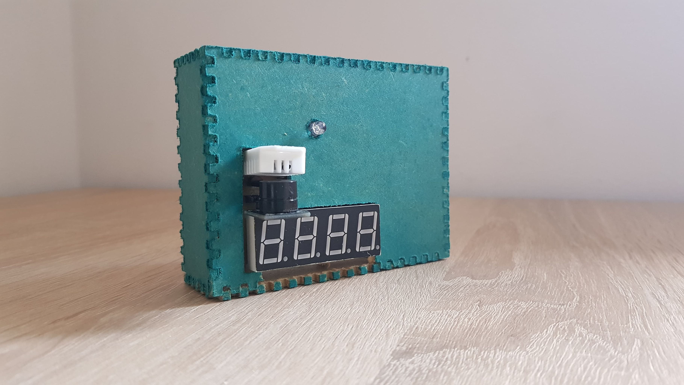

# Microclimate Guardian Raspberry PI project

  

## Project Details
- First DIY project made with friends.
- Simple temperature and humidity controller.
- Contains: aspberry Pi with sensors and actuators on an etched PCB in a CNC housing.
- The code allows the string to be replaced by the characters appearing on the 8 segment display.
- Very detailed explanation of the code in the Polish language.

## Making process video 

Video of making a project from scratch with process of etching with small snippets in polish language. (Image click redirects you to the Youtube video)

## Main system elements
- Raspberry PI 4 B
- Temperature and Humidity sensor DHT22
- RGB LED diode
- Buzzer

